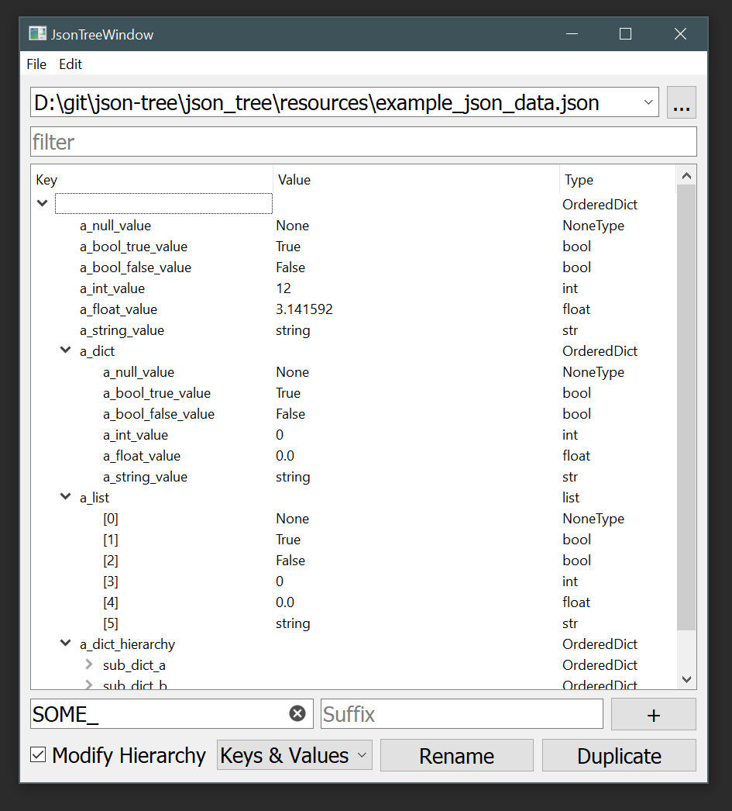

# json-tree
Editor for json/standard python data

The idea was to rewrite my old JSON Editor with proper Model/View stuff. But couldn't figure out the best way to approach re-ordering items. So unless inspiration strikes sometime in the future, this is parked.

# Install

<pre>
1. Download this package and unzip it in a good location 
    1.B (or git clone it directly if you have git installed)
2. Run installer.bat (will walk you through some options for install)
3. Restart the DCC or run start_standalone.bat
</pre>

# Start the tool
1. Run this python script

<pre>

import json_tree
json_tree.main()

</pre>

